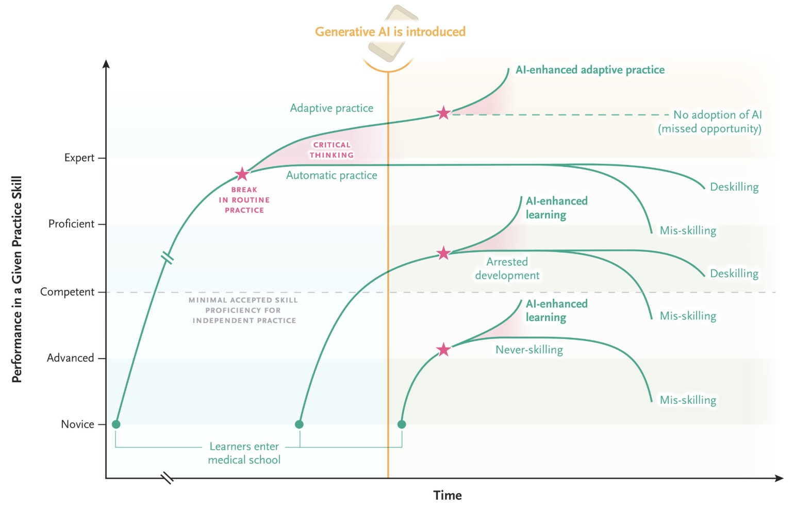
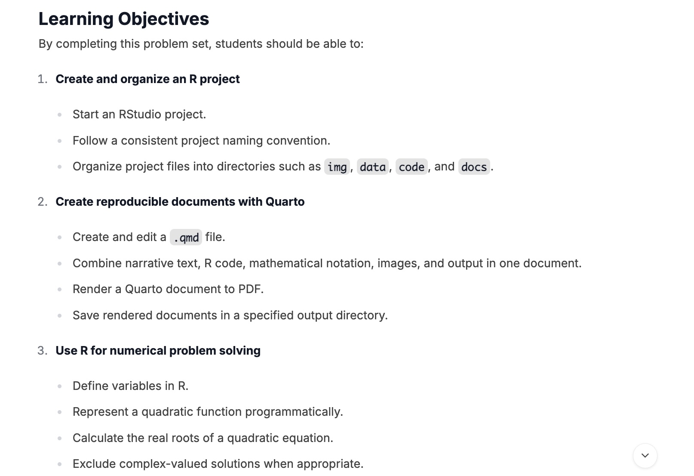
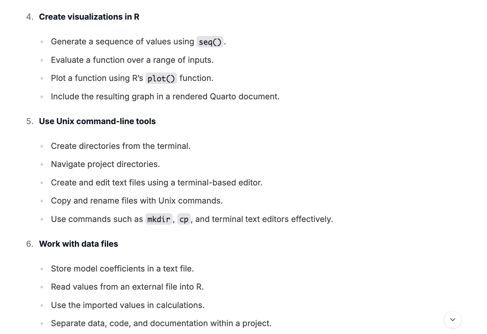
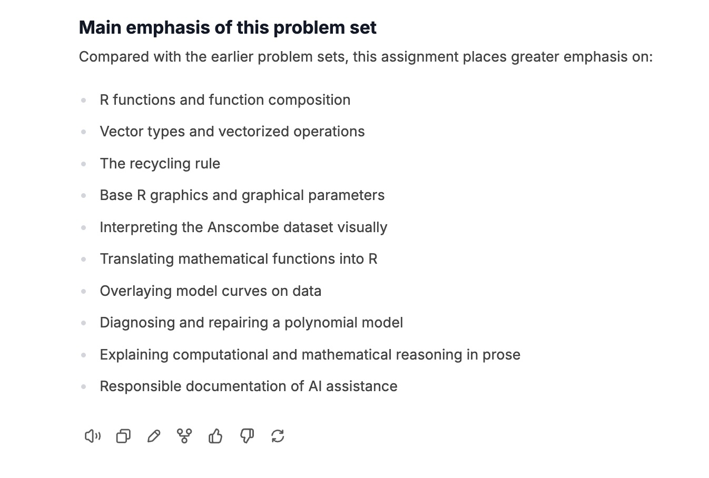
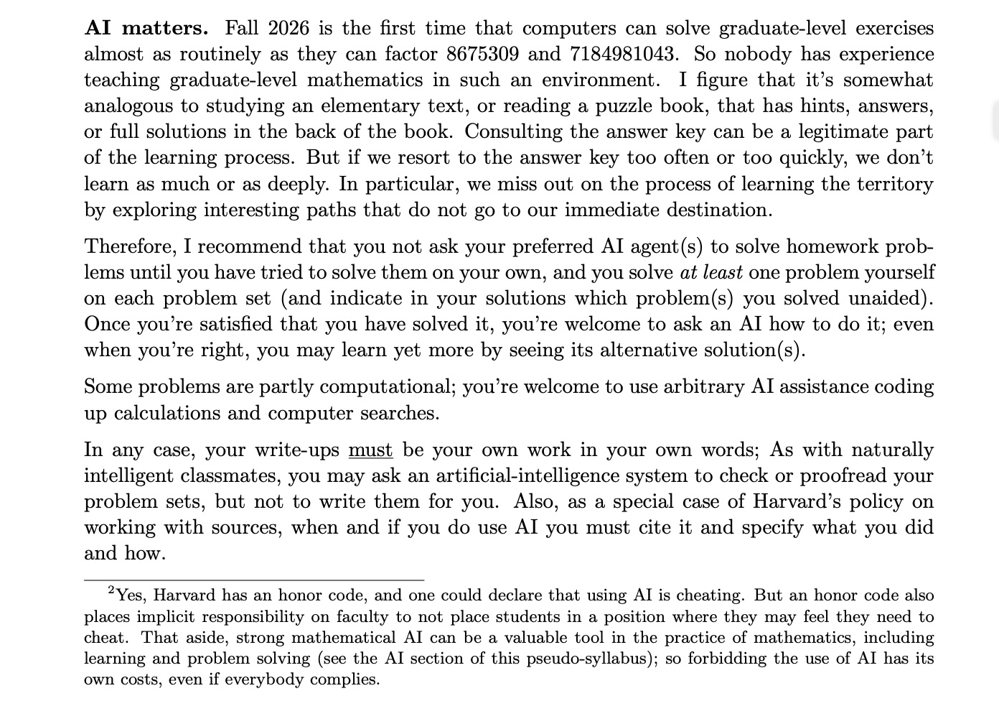
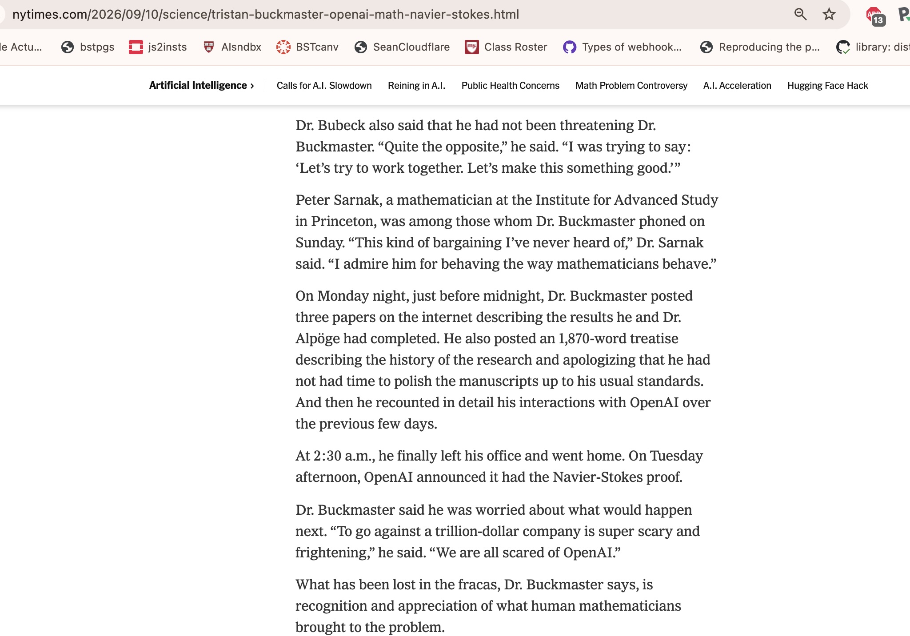

## Quick return to Unix

- sign in to the github.com ide
- with the "+" control, pick "New codespace"
- we will do some basic work in unix once the terminal starts 

## Quick notes on use of AI

```
AI Assistance
Model: GPT-5.6 Sol

Prompt: I asked ChatGPT to guide me through Problem Set 2 step by step, including understanding R vectors, ...

What I learned: I learned how vector operations and recycling work in R, how to control plot ...
```

- This is a nice, honest statement of use of AI.  
- I'd like to look at this critically.
- You have to be better than the AI ... and you can be.
- You have to be careful of mis-skilling or de-skilling...

## NEJM 2025 Abdelnour et al DOI 10.1056/NEJMra2503232



## Avoiding de-skilling, "managing the helper"

- Don't just drop the problem set into chatbot or agent environment
- This prevents "active dissection" of the problem
- Eliminates the need for strategic thinking
- Silos the student into 1-1 dialog with bot
- Problems must become harder in ways that AI "does not help"


## Summary of learning objectives of 2025 Problem set 1


 
## More learning objectives of 2025 Problem set 1



## Difference in 2026 problems (so far)



## A perspective from the [Math department](https://people.math.harvard.edu/~elkies/M229.26/plan.pdf)


 
## What is [lost](https://www.nytimes.com/2026/09/10/science/tristan-buckmaster-openai-math-navier-stokes.html) in "agentic math"{.smaller}

{height=500}


## Comments

- See also [T. Tao video](https://www.youtube.com/watch?v=mqNsHSV2Ofg)
- And [Sean Davis resources, mostly on agentic methods](https://talks.seandavis.net/)
- Always acknowledge your collaborators, even if artificial
- Always try to push the boundaries that came back ... e.g., the "grading app"
- Articulate your concerns

## A map of our destinations{.smaller}

- Principles of programming
    - symbols (syntax) mapped to operations and values (semantics)
    - data representations
    - repetitive computing: iteration and recursion
    - resource consumption: "space" and "time"; concurrency
    - fault tolerance: anticipating and responding to errors
- R for interactive "data analysis and visualization"

## Contents in production 1: vector concepts

- 0) creating or acquiring values, existence as variables, types
- 0.4) the index concept for vectors and other entities
- 0.45) producing lists via split; other features of lists
- 0.5) elements with unknown values: NA
- 0.6) infix operators and the recycling rule; implicit iteration
- 6) behaviors of split, strsplit

## 2: vector ordering and searching

- 1) meaning of sort, order
- 1.5) which, %in%, match, grep
- 3) preview/postview with head/tail
- 4) equality testing
- 5) recycling rule

## 3: aggregation 

- 2) meaning of table

## 4: flow control

- 8) flow control: loops, apply, recursion

## 5: 'randomness'

- 7) set.seed and sampling


