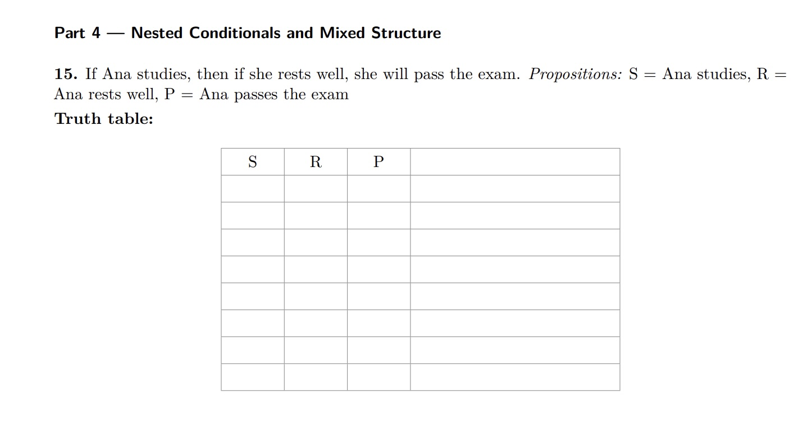

## Key concepts to date{.smaller}

- designing tables: columns are features of interest, rows correspond
to 'observations', cell values are 'measurements on features'
- creating algorithms: 
    - example of tabulating character counts in a string
    - define the goal, understand inputs, produce desired outputs
    - iteration and termination to achieve the goal
- formalizing "ideas" (1)
    - propositional logic of sentences: 
        - mapping terms to 'variables'
        - syntax for connectives that express logical relations
        - "truth tables" to characterize relationship between
sentence components and sentence truth

## Key concepts to date{.smaller}

- formalizing "ideas" (2)
    - "reading" programs in R
        - programs and statements in R
            - function evaluation underlies all 'actions'
            - vector creation and inspection
            - 'subsetting' by indexing
        - data structures and data types
            - vector, matrix
            - list, data.frame
        - understanding control flow and data evolution

## Designing and using tables

Example of murder counts

```{r lkdat, message=FALSE}
library(dslabs)
data(murders)
head(murders)
```

- What are the units of observation?

- Find the state with largest population.  What is your strategy?

## Creating algorithms

- Task: obtain the frequencies of characters in a string.
- Strategy:
    - design the output: data frame with two columns (char, count)
    - 'split' the string into individual characters
    - 'initialize' a container for counts
    - 'iterate' over the characters, updating the count container suitably
    - 'reshape' the count container as needed

## Character count example 1

```
charcount = function(string) {
  count = integer(0)                         # initialize
  chars = strsplit(string, "")[[1]]          # split
  for (cur in chars) {                       # iterate
    if (isTRUE(cur %in% names(count))) count[cur] = count[cur]+1
    else count[cur] = 1
    }                                        # reshape
  data.frame(char=dQuote(names(count)), count=count, row.names=NULL)
}
```

## Character count example 2
    
```
charcount2 = function(string) {            # implicitly:
 cvec = table(strsplit(string, "")[[1]])   # initialize, split, iterate
 data.frame(char=dQuote(names(cvec)), count=as.numeric(cvec), row.names=NULL)
}
```

## Backing up a bit: formalizing sentences



## Can we read code?

```
murders[murders$population > 10000000, ]
murders[murders$population > 10000000, c("state", "population") ]
```

## What's wrong here?

```
> murders[murders$population > 1e7]
Error in `[.data.frame`(murders, murders$population > 1e+07) : 
  undefined columns selected

Enter a frame number, or 0 to exit 

1: murders[murders$population > 1e+07]
2: `[.data.frame`(murders, murders$population > 1e+07)
```

## Naturalizing table operations with dplyr

```{r lkdp,echo=TRUE}
library(dplyr)
murders |> select(state, population) |> 
   filter(population > 1e7)
murders |> arrange(desc(population)) |> head(1)
```

Upshots: 
- think holistically about the data.frame and extract
relevant information via dplyr operations
- chain the operations using `|>` to avoid making intermediate quantities

## Doing the character count problem with dplyr

```{r lkcc,echo=TRUE}
mystr = "to be or not to be"
data.frame(char=strsplit(mystr,"")[[1]]) |>
   summarise(count=n(), .by=char) |>
   mutate(char=dQuote(char))
```

Compare, from an information perspective:


```{r lkta,echo=TRUE}
table(strsplit(mystr, "")[[1]])
```

## Upshots{.smaller}

- Ensure your familiarity with R's computational model
    - session
    - global environment
    - packages attached in searchlist
    - action through function evaluation
    - vectors (ordered elements of a single type, indexed with `[`)
        - matrices, arrays also of a single type, multidimensional
    - lists (ordered collections of vectors, which may be of different types),
indexed with `$` or `[[`
    - names of individual elements are optional but useful
- Documentation
- Authoring quarto: mixing narrative, code, and code outputs
- All content in your github.com repo

## Still to come

- review the slide sets on R and a few on wrangling
- discussion of logarithms
