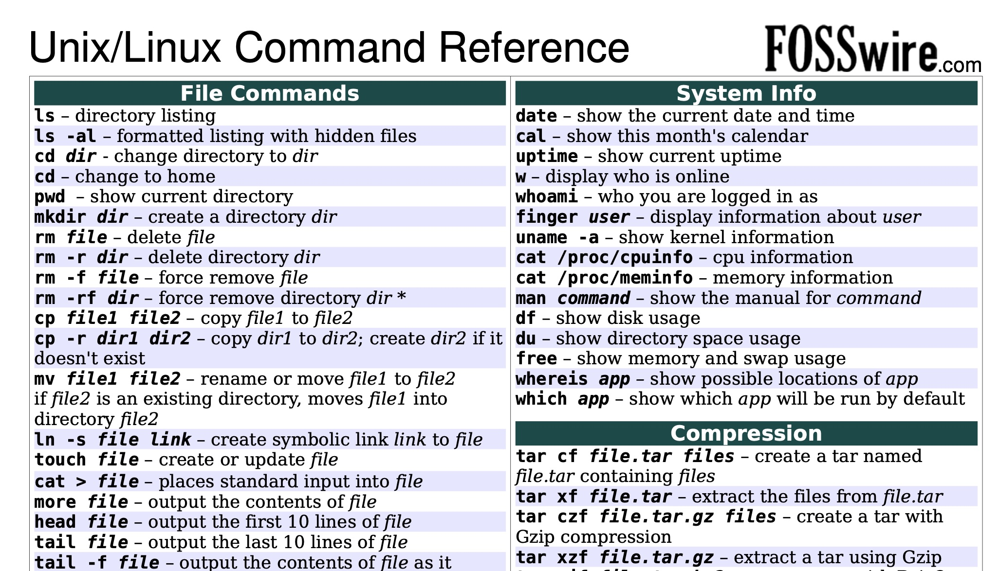
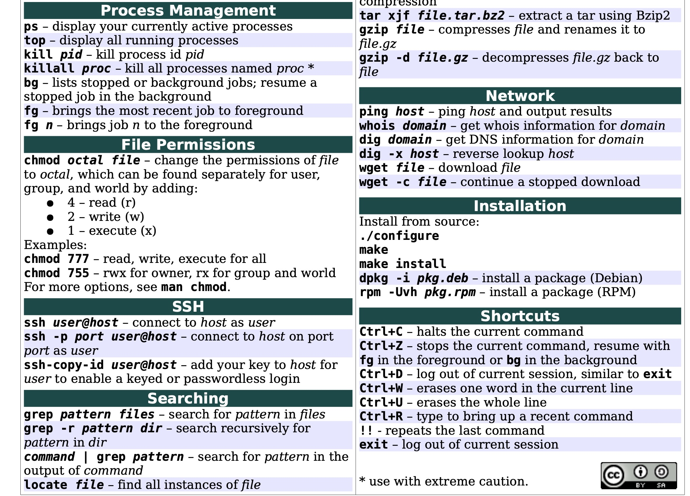

## Plan

We will form teams, with one student running Rstudio and the other working through
the form, step by step, at [https://tinyurl.com/bst260unix](https://tinyurl.com/bst260unix)

The form will be editable; after each exercise is completed, you submit (at the bottom)
and then return to your form to do the next exercise.

## Topics to have mastered{.smaller}

- Retrieving a file in a specified way
    - the file happens to be an R package
    - you will use download.packages in R console
- Working with a compressed file archive
    - you will have a .tar.gz file
    - you will expand it using classic unix command line interface
- Getting an overview of a folder system with tree
- Counting characters in a stream
- Measuring file sizes, with the tool of your choice
- Finding strings in files using grep
- Working with cryptographic hashes
- Using a file compression utility

## Illustration of a command map

## More commands

